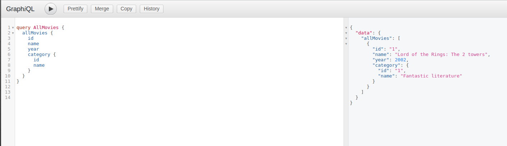

## Django Graphql

Tutorial on how to integrate Graphql in Django through Graphene.

[Documentation](https://docs.graphene-python.org/projects/django/en/latest/)

## GraphQL
> GraphQL is a query language for APIs and a runtime for fulfilling those queries with your existing data. GraphQL provides a complete and understandable description of the data in your API, gives clients the power to ask for exactly what they need and nothing more, makes it easier to evolve APIs over time, and enables powerful developer tools. - [Official documentation](https://graphql.org/)

## Graphene

> Graphene-Python is a library for building GraphQL APIs in Python easily, its main goal is to provide a simple but extendable API for making developers' lives easier. - [Official documentation](https://graphene-python.org/)

# Basic

1. Install graphene:

~~~
pip install django graphene_django
~~~

2. Add graphene_django as INSTALLED_APPS:

~~~

INSTALLED_APPS = [
    ...,
    'graphene_django',
]
~~~

3. Create an directory called `graphene_scheme` with 4 files:

~~~
graphene_scheme/__init__.py # Python module
graphene_scheme/types.py # object types
graphene_scheme/query.py # Queries
graphene_scheme/schema.py # graphene schema
~~~

4. Add graphene_scheme as INSTALLED_APPS:

~~~

INSTALLED_APPS = [
    ...,
    'graphene_django',
    'graphene_scheme',
]
~~~

5. Add the SCHEMA to the GRAPHENE config in `django_graphql/settings.py`:

~~~
GRAPHENE = {
    "SCHEMA": "cookbook.schema.schema"
}
~~~

6. Unlike a RESTful API, there is only a single URL from which GraphQL is accessed. Requests to this URL are handled by Graphene’s GraphQLView view.

This view will serve as GraphQL endpoint. As we want to have the aforementioned GraphiQL we specify that on the parameters with `graphiql=True`.

~~~
from graphene_django.views import GraphQLView
urlpatterns = [
  ...
  path('graphql/', GraphQLView.as_view(graphiql=True)),
]
~~~

7. If we didn’t specify the target schema in the Django settings file as explained above, we can do so here using:

~~~
from apps.graphene_scheme.schema import schema

urlpatterns = [
  ...
  path('graphql/', GraphQLView.as_view(graphiql=True, schema=schema)),
]
~~~

8. Run the server:
~~~
python manage.py runserver
~~~

9. Go to localhost:8000/graphql and type your first query!

~~~
query{
  allMovies{
    name
    category{
      name
    }
  }
}
~~~

## Summary
As you can see, GraphQL is very powerful and integrating Django models allows you to get started with a working server quickly.